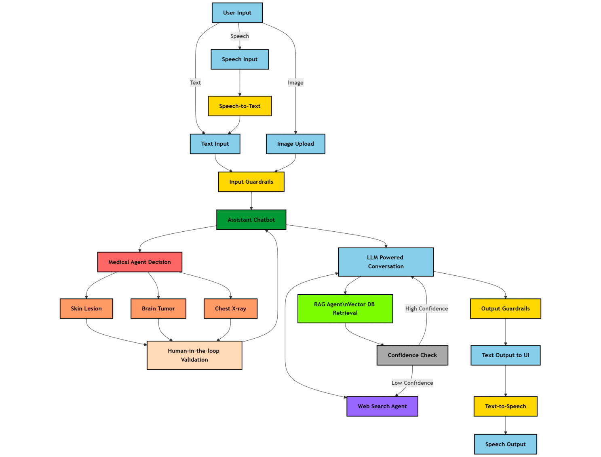

## 🧠 Multi-Agent Medical Assistant

### 🌟 AI-powered multi-agentic system for medical diagnosis and assistance

<div align="center">


</div>

---

## 📌 Overview

The **Multi-Agent Medical Assistant** is an **AI-powered chatbot** designed to assist with **medical diagnosis, research, and patient interactions**.

### Key Highlights:

* Integrates **Large Language Models (LLMs)**
* Supports **medical imaging** via computer vision
* **Retrieval-Augmented Generation (RAG)** with vector database
* **Real-time web search** for latest research
* **Human-in-the-loop** validation for medical safety

## 📈 Technical Flow



## ✨ Features

* Multi-agent architecture for task-specific processing
* Hybrid RAG with Docling, Qdrant, semantic chunking, reranking
* Computer Vision: Chest X-ray, Skin Lesion, Brain Tumor (TBD)
* Real-time research via web scraping agents
* Voice interaction using Eleven Labs
* Confidence scoring and agent handoff to ensure accuracy
* Human-in-the-loop verification and safety guardrails

## 🛠️ Tech Stack

| Component        | Technologies                       |
| ---------------- | ---------------------------------- |
| Backend          | FastAPI                            |
| Agents           | LangGraph, LangChain               |
| Document Parsing | Docling                            |
| Database         | Qdrant Vector DB                   |
| Vision Models    | PyTorch (image classification/seg) |
| Speech API       | Eleven Labs                        |
| Frontend         | HTML, CSS, JavaScript              |
| Deployment       | Docker                             |

## 🚀 Setup

### Docker

```bash
# Clone
git clone https://github.com/Anjaniputra15/Medico-assistant-.git
cd Medico-assistant-

# .env with API keys
# see README for variables needed

# Build & Run
docker build -t medical-assistant .
docker run -d -p 8000:8000 --env-file .env medical-assistant
```

### Manual

```bash
# Create virtual environment
python -m venv env
source env/bin/activate

# Install dependencies
pip install -r requirements.txt

# Add API keys to .env

# Run
python app.py
```

## 🤔 Usage

* Upload images for CV-based diagnosis
* Ask queries for RAG or web-retrieval answers
* Use voice commands via Eleven Labs
* Confirm responses through human validation

## 🤝 Contributions

PRs welcome. Open issues or ideas in the Issues tab.

## ⚖️ License

Apache-2.0 License

## 📅 Citation

```bibtex
@misc{Anjaniputra15_2025,
  Author = {Anjaniputra15},
  Title = {Multi Agent Medical Assistant},
  Year = {2025},
  Publisher = {GitHub},
  Howpublished = {\url{https://github.com/Anjaniputra15/Medico-assistant-}}
}
```

## 📩 Contact

For questions or collaborations, reach out via GitHub: [https://github.com/Anjaniputra15](https://github.com/Anjaniputra15)

<p align="right">
 <a href="#top"><b>🔝 Back to top</b></a>
</p>
